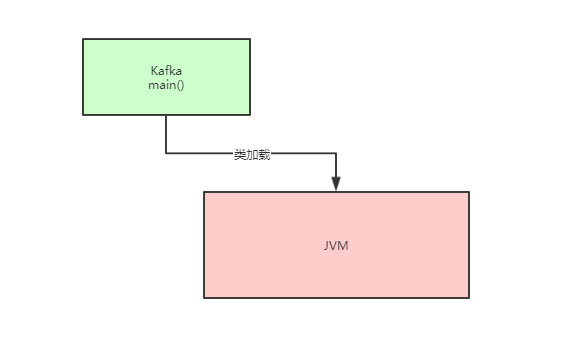
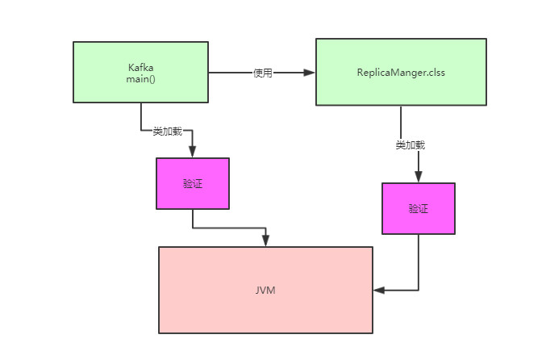
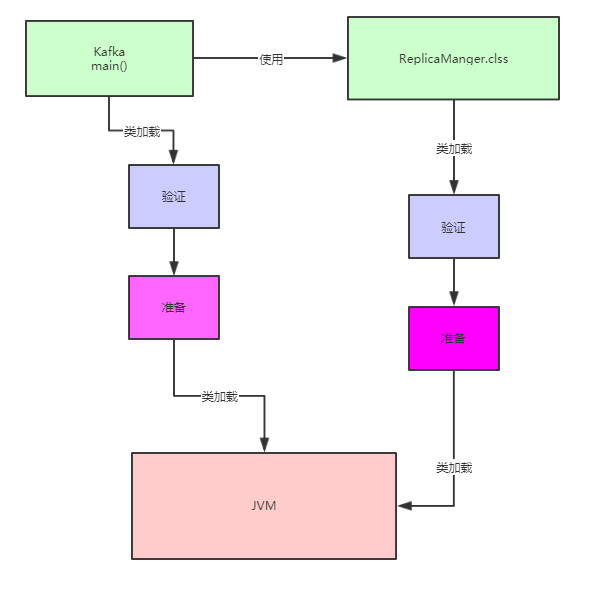
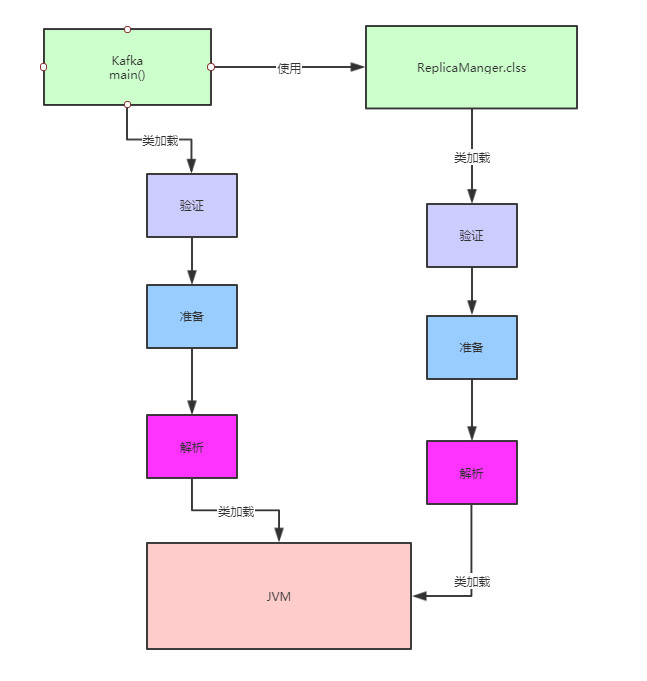
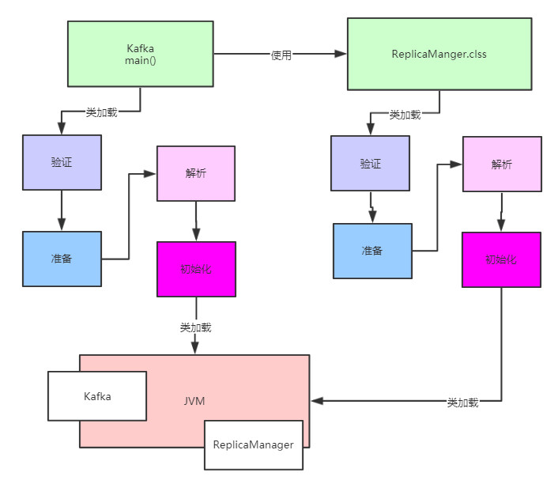
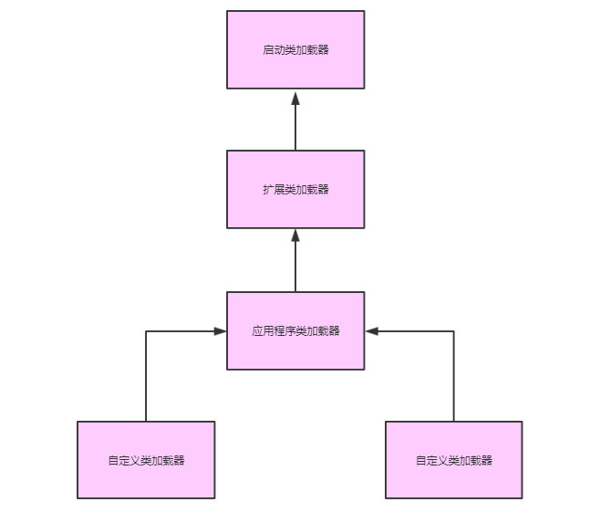

# JVM会在什么情况加载一个类？

一个类从加载到使用，一般会经历下面的这个过程：

**加载  -> 验证 -> 准备 -> 解析 -> 初始化 ->  使用 -> 卸载**

所以首先要搞明白的第一个问题，就是JVM在执行我们写好的代码的过程中，一般在什么情况下会去加载一个类呢？

也就是说，啥时候会从“.class”字节码文件中加载这个类到JVM内存里来。

答案就是： **在你的代码中，用到这个类的时候**


举个简单的例子，比如下面你有一个类（Kafka.class），里面有一个“main()”方法作为主入口。

那么一旦你的JVM进程启动之后，它一定会先把你的这个类（Kafka.cass）加载到内存里，然后从“main()”方法的入口代码开始执行。

```java
public class Kafka {
    public static void main(String[] args) {
    	
    }
}
```

图示：



接着假设上面的代码中，出现了如下的这么一行代码：

```java
public class Kafka {
    public static void main(String[] args) {
    	
        ReplicaManager replicaManager = new ReplicaManager();
    }
}
```

这时可能大家就想了，你的代码中明显需要使用“ReplicaManager”这个类去实例化一个对象，此时必须得把“ReplicaManager.class”字节码文件中的这个类加载到内存里来啊！是不是？

所以这个时候就会触发JVM通过类加载器，从“ReplicaManager.class”字节码文件中加载对应的类到内存里来使用，这样代码才能跑起来。


简单概括一下：首先你的代码中包含“main()”方法的主类一定会在JVM进程启动之后被加载到内存，开始执行你的“main()”方法中的代码

接着遇到你使用了别的类，比如“ReplicaManager”，此时就会从对应的“.class”字节码文件加载对应的类到内存里来。


# 验证、准备、初始化的过程

## 验证阶段

简单来说，这一步就是根据Java虚拟机规范，来校验你加载进来的“.class”文件中的内容，是否符合指定的规范。

这个相信很好理解，假如说，你的“.class”文件被人篡改了，里面的字节码压根儿不符合规范，那么JVM是没法去执行这个字节码的！

所以把“.class”加载到内存里之后，必须先验证一下，校验他必须完全符合JVM规范，后续才能交给JVM来运行。



## 准备阶段

这个阶段其实也很好理解，咱们都知道，我们写好的那些类，其实都有一些类变量

比如下面的这个“ReplicaManager”类

```java
public class ReplicaManager {
    public static int flushInterval;
}
```

假设你有这么一个“ReplicaManager”类，他的“ReplicaManager.class”文件内容刚刚被加载到内存之后，会进行验证，确认这个字节码文件的内容是规范的

接着就会进行准备工作。

这个准备工作，其实就是给这个“ReplicaManager”类分配一定的内存空间

然后给他里面的**类变量（也就是static修饰的变量）分配内存空间，来一个默认的初始值**

比如上面的示例里，就会给“flushInterval”这个类变量分配内容空间，给一个“0”这个初始值。



## 解析阶段

这个阶段干的事儿，实际上是把**符号引用替换为直接引用**的过程，其实这个部分的内容很复杂，涉及到JVM的底层



## 三个阶段小结

其实这三个阶段里，最核心的大家务必关注的，就是**“准备阶段”**

因为这个阶段是给加载进来的类分配好了内存空间，类变量也分配好了内存空间，并且给了默认的初始值，这个概念，大家心里一定要有。


## 核心阶段-初始化

在准备阶段时，就会把我们的“ReplicaManager”类给分配好内存空间

另外他的一个类变量“flushInterval”也会给一个默认的初始值“0”，那么接下来，在初始化阶段，就会正式执行我们的类初始化的代码

那么什么是类初始化的代码呢？我们来看看下面这段代码：

```java
public class ReplicaManager {
    public static int flushInterval =
         Configuration.getInt("replica.flush.interval")；
}
```

可以看到，对于“flushInterval”这个类变量，我们是打算通过Configuration.getInt("replica.flush.interval")这段代码来获取一个值，并且赋值给他的

**但是在准备阶段会执行这个赋值逻辑吗？**

**NO！**在准备阶段，仅仅是给“flushInterval”类变量开辟一个内存空间，然后给个初始值“0”罢了。

那么这段赋值的代码什么时候执行呢？答案是在**“初始化”**阶段来执行。

在这个阶段，就会执行类的初始化代码，比如上面的  Configuration.getInt("replica.flush.interval")  代码就会在这里执行，完成一个配置项的读取，然后赋值给这个类变量“flushInterval”。

另外比如下图的static静态代码块，也会在这个阶段来执行。

类似下面的代码语义，可以理解为类初始化的时候，调用“loadReplicaFromDish()”方法从磁盘中加载数据副本，并且放在静态变量“replicas”中：

```java
public class ReplicaManager {
    public static int flushInterval =
         Configuration.getInt("replica.flush.interval")；


    public static Map<String, Replica> replicas;
        
	static {
        loadReplicaFromDisk();
    }
	
    public static void loadReplicaFromDisk() {
        replicas = new HashMap<String, Replica>();
    }
}
```

那么搞明白了类的初始化是什么，就得来看看类的初始化的规则了。

**什么时候会初始化一个类？**

一般来说有以下一些时机：比如“new ReplicaManager()”来实例化类的对象了，此时就会触发类的加载到初始化的全过程，把这个类准备好，然后再实例化一个对象出来；

或者是包含“main()”方法的主类，必须是立马初始化的。

此外，这里还有一个非常重要的规则，就是如果初始化一个类的时候，发现他的父类还没初始化，那么必须先初始化他的父类

```java
public class ReplicaManager extends AbstractDataManager{
    public static int flushInterval =
         Configuration.getInt("replica.flush.interval")；


    public static Map<String, Replica> replicas;
        
	static {
        loadReplicaFromDisk();
    }
	
    public static void loadReplicaFromDisk() {
        replicas = new HashMap<String, Replica>();
    }
}
```

如果你要“new ReplicaManager()”初始化这个类的实例，那么会加载这个类，然后初始化这个类

但是初始化这个类之前，发现AbstractDataManager作为父类还没加载和初始化，那么必须先加载这个父类，并且初始化这个父类。



# 类加载器

实现上述过程，那必须是依靠类加载器来实现的

那么Java里有哪些类加载器呢？简单来说有下面几种


## 启动类加载器

**Bootstrap ClassLoader**  它主要是负责加载我们在机器上安装的Java目录下的核心类的

相信大家都知道，如果你要在一个机器上运行自己写好的Java系统，无论是windows笔记本，还是linux服务器，是不是都得装一下JDK？

那么在你的Java安装目录下，就有一个“**lib**”目录，这里就有Java最核心的一些类库，支撑你的Java系统的运行。

所以一旦你的JVM启动，那么首先就会依托启动类加载器，去加载你的Java安装目录下的“lib”目录中的核心类库。


## 扩展类加载器

**Extension ClassLoader**，这个类加载器其实也是类似的，就是你的Java安装目录下，有一个“lib\ext”目录

这里面有一些类，就是需要使用这个类加载器来加载的，支撑你的系统的运行。

那么你的JVM一旦启动，是不是也得从Java安装目录下，加载这个“lib\ext”目录中的类？


## 应用程序类加载器

**Application ClassLoader**，这类加载器就负责去加载“ClassPath”环境变量所指定的路径中的类

其实你大致就理解为去加载你写好的Java代码吧，这个类加载器就负责加载你写好的那些类到内存里。


## 自定义类加载器

除了上面那几种之外，还可以自定义类加载器，去根据你自己的需求加载你的类。


# 双亲委派机制

JVM的类加载器是有亲子层级结构的，就是说启动类加载器是最上层的，扩展类加载器在第二层，第三层是应用程序类加载器，最后一层是自定义类加载器。



然后，基于这个亲子层级结构，就有一个**双亲委派的机制**

就是假设你的应用程序类加载器需要加载一个类，他首先会委派给自己的父类加载器去加载，最终传导到顶层的类加载器去加载

但是如果父类加载器在自己负责加载的范围内，没找到这个类，那么就会下推加载权利给自己的子类加载器。

比如你的JVM现在需要加载“ReplicaManager”类，此时应用程序类加载器会问问自己的爸爸，也就是扩展类加载器，你能加载到这个类吗？

然后扩展类加载器直接问自己的爸爸，启动类加载器，你能加载到这个类吗？

启动类加载器心想，我在Java安装目录下，没找到这个类啊，**自己找去**！

然后，就下推加载权利给扩展类加载器这个儿子，结果扩展类加载器找了半天，也没找到自己负责的目录中有这个类。

这时他很生气，说：明明就是你应用程序加载器自己负责的，你自己找去。

然后应用程序类加载器在自己负责的范围内，比如就是你写好的那个系统打包成的jar包吧，一下子发现，就在这里！然后就自己把这个类加载到内存里去了。

这就是所谓的**双亲委派模型：**先找父亲去加载，不行的话再由儿子来加载。


这样的话，可以**避免多层级的加载器结构重复加载某些类**。

最后，给大家来一张图图，感受一下类加载器的双亲委派模型。

.jpg)