# 到底什么是JVM的内存区域划分

其实这个问题非常简单，JVM在运行我们写好的代码时，他是必须使用多块内存空间的，不同的内存空间用来放不同的数据，然后配合我们写的代码流程，才能让我们的系统运行起来。

举个最简单的例子，比如咱们现在知道了JVM会加载类到内存里来供后续运行，那么我问问大家，这些类加载到内存以后，放到哪儿去了呢？想过这个问题吗？

所以JVM里就必须有一块内存区域，用来存放我们写的那些类。

我们来看下面的图：

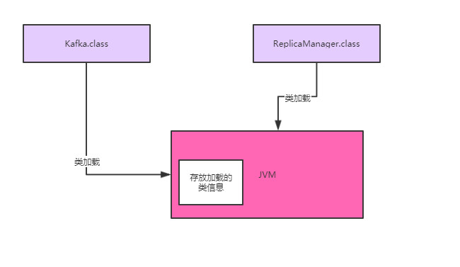

继续来看，我们的代码运行起来时，是不是需要执行我们写的一个一个的方法？

那么运行方法的时候，方法里面有很多变量之类的东西，是不是需要放在某个内存区域里？

接着如果我们写的代码里创建一些对象，这些对象是不是也需要内存空间来存放？

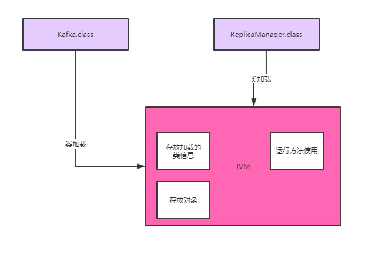

这就是为什么JVM中必须划分出来不同的内存区域，它是为了我们写好的代码在运行过程中根据需要来使用的。


# 存放类的-方法区

这个方法区是在JDK 1.8以前的版本里，代表JVM中的一块区域。

主要是放从“.class”文件里加载进来的类，还会有一些类似常量池、静态变量的东西放在这个区域里。

但是在JDK 1.8以后，这块区域的名字改了，叫做**“Metaspace”**，可以认为是“元数据空间”这样的意思。当然这里主要还是存放我们自己写的各种类相关的信息。

举个例子，还是跟我们之前说的那样，假设我们有一个“Kafka.class”类和“ReplicaManager.class”类，类似下面的代码。

```java
public class Kafka {
    public static void main(String[] args) {
    	
        ReplicaManager replicaManager = new ReplicaManager();
    }
}
```


这两个类加载到JVM后，就会放在这个方法区中，大家看下图：

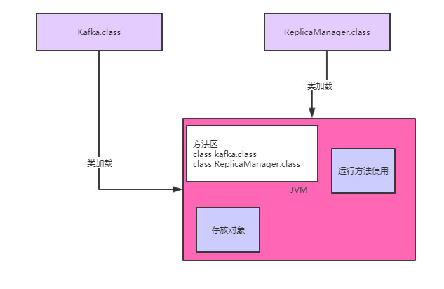

# 执行代码指令用的-程序计数器

继续假设我们的代码是如下所示：

```java
public class Kafka {
    public static void main(String[] args) {
    	
        ReplicaManager replicaManager = new ReplicaManager();
        replicaManager.loadReplicaFromDisk();
    }
}
```

实际上上面那段代码首先会存在于“.java”后缀的文件里，这个文件就是java源代码文件。

但是这个文件是面向我们程序员的，计算机他是看不懂你写的这段代码的。

所以此时就得通过编译器，把“.java”后缀的源代码文件编译为“.class”后缀的字节码文件。

这个“.class”后缀的字节码文件里，存放的就是对你写出来的代码编译好的字节码了。

字节码才是计算器可以理解的一种语言，而不是我们写出来的那一堆代码。

字节码看起来大概是下面这样的，跟上面的代码无关，就是一个示例而已，给大家感受一下。

```class
public java.lang.String.getName（）；
	descriptor: ()Ljava/lang/String;
	flags; ACC_PUBLIC
	Code:
		stack=1, locals=1. args_size=1
        0:aload_0
        1:get_filed
        4:areturn
```


这段字节码就是让大家知道“.java”翻译成的“.class”是大概什么样子的。

比如“0: aload_0”这样的，就是“字节码指令”，他对应了一条一条的机器指令，计算机只有读到这种机器码指令，才知道具体应该要干什么

比如字节码指令可能会让计算机从内存里读取某个数据，或者把某个数据写入到内存里去，都有可能，各种各样的指令就会指示计算机去干各种各样的事情。

所以现在大家首先明白一点：**我们写好的Java代码会被翻译成字节码，对应各种字节码指令**

现在Java代码通过JVM跑起来的第一件事情就明确了， 首先Java代码被编译成字节码指令，然后字节码指令一定会被一条一条执行，这样才能实现我们写好的代码执行的效果。

所以当JVM加载类信息到内存之后，实际就会使用自己的**字节码执行引擎**，去执行我们写的代码编译出来的代码指令，如下图。

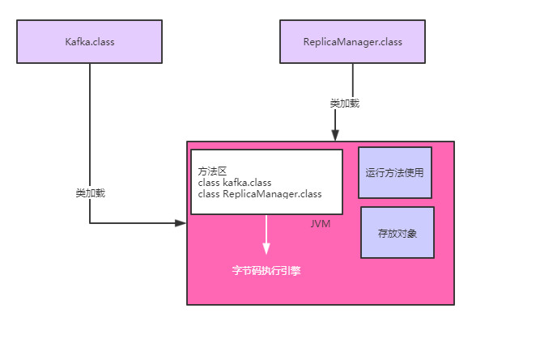

那么在执行字节码指令的时候，JVM里就需要一个特殊的内存区域了，那就是“程序计数器”

这个程序计数器就是用来记录当前执行的字节码指令的位置的，也就是记录目前执行到了哪一条字节码指令。

我们通过一张图来说明：

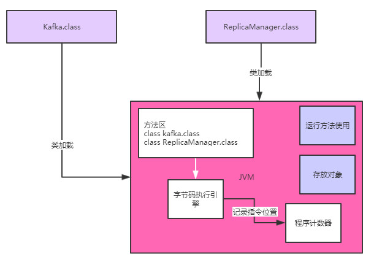

大家都知道JVM是支持多个线程的，所以其实你写好的代码可能会开启多个线程并发执行不同的代码，所以就会有多个线程来并发的执行不同的代码指令

因此每个线程都会有自己的一个程序计数器，专门记录当前这个线程目前执行到了哪一条字节码指令了

下图更加清晰的展示出了他们之间的关系。

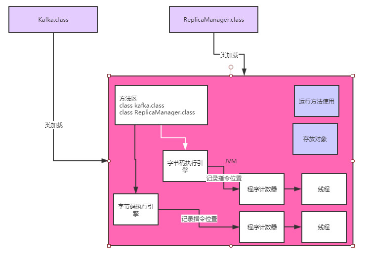

# Java虚拟机栈

Java代码在执行的时候，一定是线程来执行某个方法中的代码

哪怕就是下面的代码，也会有一个main线程来执行main()方法里的代码

在main线程执行main()方法的代码指令的时候，就会通过main线程对应的程序计数器记录自己执行的指令位置。

```java
public class Kafka {
    public static void main(String[] args) {
    	
        ReplicaManager replicaManager = new ReplicaManager();
        replicaManager.loadReplicaFromDisk();
    }
}
```

但是在方法里，我们经常会定义一些方法内的局部变量

比如在上面的main()方法里，其实就有一个“replicaManager”局部变量，他是引用一个ReplicaManager实例对象的，关于这个对象我们先别去管他，先来看方法和局部变量。

因此，JVM必须有一块区域是来保存每个方法内的**局部变量**等数据的，这个区域就是**Java虚拟机栈**

**每个线程都有自己的Java虚拟机栈**，比如这里的main线程就会有自己的一个Java虚拟机栈，用来存放自己执行的那些方法的局部变量。

如果线程执行了一个方法，就会对这个方法调用创建对应的一个**栈帧**

**栈帧里就有这个方法的局部变量表 、操作数栈、动态链接、方法出口等东西，这里大家先不用全都理解，我们先关注局部变量。**

比如main线程执行了main()方法，那么就会给这个main()方法创建一个栈帧，压入main线程的Java虚拟机栈

同时在main()方法的栈帧里，会存放对应的“replicaManager”局部变量

上述过程，如下图所示：

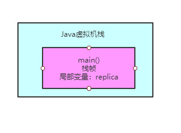

然后假设main线程继续执行ReplicaManager对象里的方法，比如下面这样，就在“loadReplicasFromDisk”方法里定义了一个局部变量：“hasFinishedLoad”

```java
public class ReplicaManager {
    
    public void loadReplicaFromDisk() {
        Boolean hasFinishedLoad = flase;
    }
}
```

那么main线程在执行上面的“loadReplicasFromDisk”方法时，就会为“loadReplicasFromDisk”方法创建一个栈帧压入线程自己的Java虚拟机栈里面去。

然后在栈帧的局部变量表里就会有“hasFinishedLoad”这个局部变量。

整个过程如下图所示：

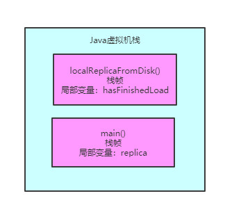

然后如果“loadReplicasFromDisk”方法执行完毕了，就会把“loadReplicasFromDisk”方法也从Java虚拟机栈里出栈。

上述就是JVM中的“Java虚拟机栈”这个组件的作用：调用执行任何方法时，都会给方法创建栈帧然后入栈

在栈帧里存放了这个方法对应的局部变量之类的数据，包括这个方法执行的其他相关的信息，方法执行完毕之后就出栈。

咱们再来看一个图，了解一下每个线程在执行代码时，除了程序计数器以外，还搭配了一个Java虚拟机栈内存区域来存放每个方法中的局部变量表。

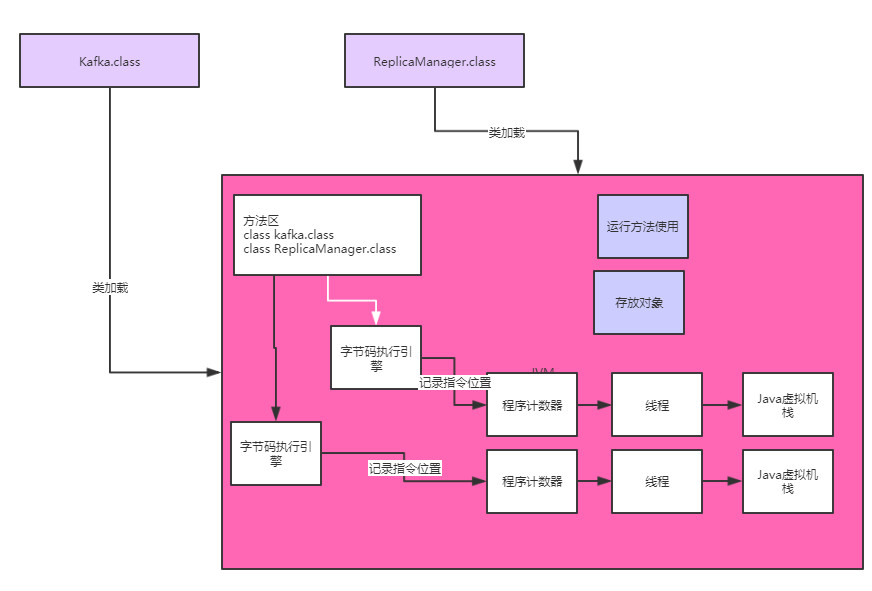


# Java堆内存

现在大家都知道了，main线程执行main()方法的时候，会有自己的程序计数器。

此外，还会依次把main()方法，loadReplicasFromDisk()方法，isLocalDataCorrupt()方法的栈帧压入Java虚拟机栈，存放每个方法的局部变量。

那么接着我们就得来看JVM中的另外一个非常关键的区域，就是Java堆内存，这里就是存放我们在代码中创建的各种对象的

比如下面的代码：

```java
public class Kafka {
    public static void main(String[] args) {
    	
        ReplicaManager replicaManager = new ReplicaManager();
        replicaManager.loadReplicaFromDisk();
    }
}
```

上面的“new ReplicaManager()”这个代码就是创建了一个ReplicaManager类的对象实例，这个对象实例里面会包含一些数据，如下面的代码所示。

这个“ReplicaManager”类里的“replicaCount”就是属于这个对象实例的一个数据。

类似ReplicaManager这样的对象实例，就会存放在Java堆内存里。

```java
public class ReplicaManager {
    
    private long replicaCount;
    
    public void loadReplicaFromDisk() {
        Boolean hasFinishedLoad = false;
        if (isLocalDateCorrupt()) {}
    }
    
    public Boolean isLocalDateCorrupt() {
        Boolean isCurrupt = false;
        return isCurrupt;
    }
}
```

Java堆内存区域里会放入类似ReplicaManager的对象，然后我们因为在main方法里创建了ReplicaManager对象的，那么在线程执行main方法代码的时候，就会在main方法对应的栈帧的局部变量表里，让一个引用类型的“replicaManager”局部变量来存放ReplicaManager对象的地址

相当于你可以认为局部变量表里的“replicaManager”指向了Java堆内存里的ReplicaManager对象

如图所示：

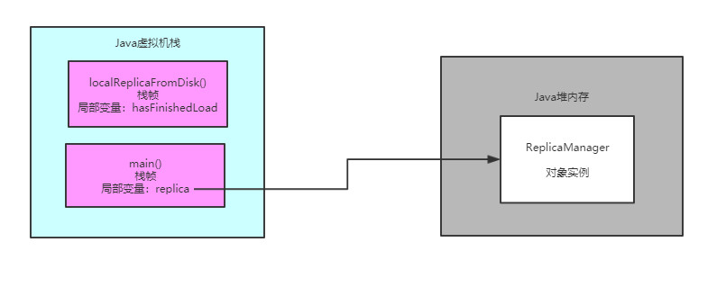

# 核心流程梳理

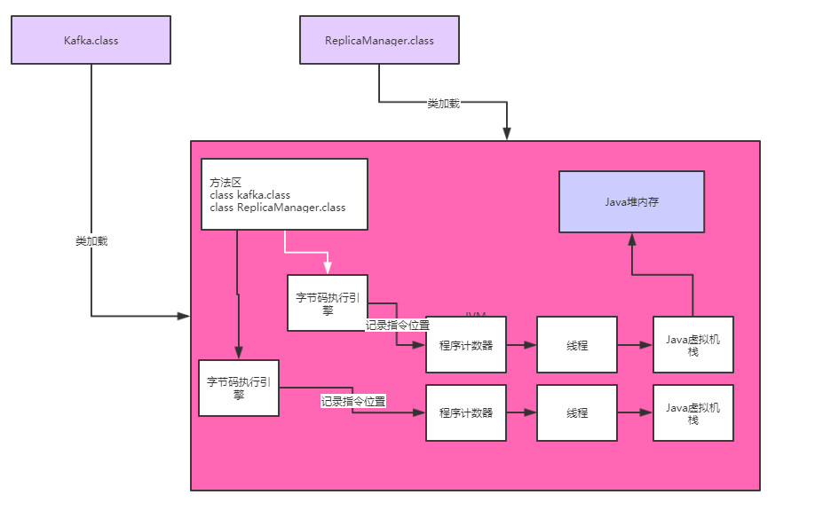

```java
public class Kafka {
    public static void main(String[] args) {
    	
        ReplicaManager replicaManager = new ReplicaManager();
        replicaManager.loadReplicaFromDisk();
    }
}

public class ReplicaManager {
    
    private long replicaCount;
    
    public void loadReplicaFromDisk() {
        Boolean hasFinishedLoad = false;
        if (isLocalDateCorrupt()) {}
    }
    
    public Boolean isLocalDateCorrupt() {
        Boolean isCurrupt = false;
        return isCurrupt;
    }
}
```

首先，你的JVM进程会启动，就会先加载你的Kafka类到内存里。然后有一个main线程，开始执行你的Kafka中的main()方法。

main线程是关联了一个程序计数器的，那么他执行到哪一行指令，就会记录在这里

其次，就是main线程在执行main()方法的时候，会在main线程关联的Java虚拟机栈里，压入一个main()方法的栈帧。

接着会发现需要创建一个ReplicaManager类的实例对象，此时会加载ReplicaManager类到内存里来。

然后会创建一个ReplicaManager的对象实例分配在Java堆内存里，并且在main()方法的栈帧里的局部变量表引入一个“replicaManager”变量，让他引用ReplicaManager对象在Java堆内存中的地址。

接着，main线程开始执行ReplicaManager对象中的方法，会依次把自己执行到的方法对应的栈帧压入自己的Java虚拟机栈

执行完方法之后再把方法对应的栈帧从Java虚拟机栈里出栈。


# 其他内存区域

其实在JDK很多底层API里，比如IO相关的，NIO相关的，网络Socket相关的

如果大家去看他内部的源码，会发现很多地方都不是Java代码了，而是走的native方法去调用本地操作系统里面的一些方法，可能调用的都是c语言写的方法，或者一些底层类库

比如下面这样的：public native int hashCode();

在调用这种native方法的时候，就会有线程对应的本地方法栈，这个里面也是跟Java虚拟机栈类似的，也是存放各种native方法的局部变量表之类的信息。

还有一个区域，是不属于JVM的，通过NIO中的allocateDirect这种API，可以在Java堆外分配内存空间。然后，通过Java虚拟机里的DirectByteBuffer来引用和操作堆外内存空间。

其实很多技术都会用这种方式，因为有一些场景下，堆外内存分配可以提升性能