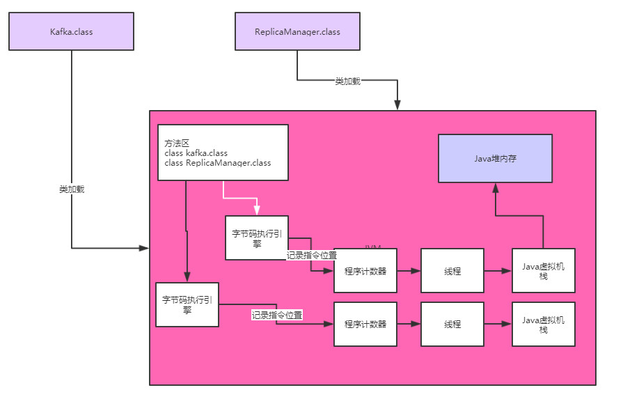

# JVM内存区域示意图



这个图一定要记在脑子里面， 你的代码在运行的时候，起码有一个main线程会去执行所有的代码，当然也可能是你启动的别的线程。 

然后线程执行时必须通过自己的程序计数器来记录执行到哪一个代码指令了

另外线程在执行方法时，为每个方法都得创建一个栈帧放入自己的Java虚拟机栈里去，里面有方法的局部变量。

最后就是代码运行过程中创建的各种对象，都是放在Java堆内存里的。

这其实就是JVM的一个基本的原理


# 对象的分配和引用

 假设有下面一段代码，大概意思你可以理解为通过“loadReplicasFromDisk”方法的执行，去磁盘上加载需要的副本数据 

 然后通过“ReplicaManager”对象实例完成了这个操作。 

```java
public class Kafka {
    public static void main (String[] args) {
        loadReplicasFromDisk();
    }
    public static void loadReplicasFromDisk() {
        ReplicaManager replicaManager = new ReplicaManager();
        replicaManger.load();
    }
}
```

首先main线程肯定会来执行main()方法

main线程肯定是有自己的一个虚拟机栈，他会将main()方法压入到main线程的Java虚拟机栈中

如图所示：


接着，main()方法里面调用了loadReplicasFromDisk()方法，现在，loadReplicasFromDisk()方法也就压入栈中了

如图所示：


接着，loadReplicaFromDisk()方法中，有一个局部变量replicaManager，就会将replicaManager变量放入到loadReplicasFromDisk()方法的栈帧中

如图所示：


接着，发现代码中创建了ReplicaManager的实例对象，那么此时就会在Java堆内存中分配实例对象的内存空间

同时，replicaManager变量会指向Java堆内存中的ReplicaManger实例对象

如图所示：


接下来就会通过replicaManger局部变量去执行它引用的ReplicaManger实例的load()方法，完成逻辑


# 一个方法执行完毕之后会怎样

看代码：

```java
public class Kafka {
    public static void main (String[] args) {
        loadReplicasFromDisk();
    }
    public static void loadReplicasFromDisk() {
        ReplicaManager replicaManager = new ReplicaManager();
        replicaManger.load();
    }
}
```

那么load()方法执行完毕之后会怎么样呢？

 一旦方法里的代码执行完毕，那么方法就执行完毕了，也就是说loadReplicasFromDisk()方法就执行完毕了。 

 一旦你的loadReplicasFromDisk()方法执行完毕，此时就会把loadReplicasFromDisk()方法对应的栈帧从main线程的Java虚拟机栈里出栈，此时java内存空间是这样子的

如图所示：


此时一旦loadReplicasFromDisk()方法的栈帧出栈，那么大家会发现那个栈帧里的局部变量，“replicaManager”，也就没有了。

也就是说，没有任何一个变量指向Java堆内存里的“ReplicaManager”实例对象了。


# 创建的Java对象占用内存资源

核心点来了，此时发现了，Java堆内存里的那个“ReplicaManager”实例对象已经没有人引用他了

这个对象实际上已经没用了，该干的事儿都干完了，现在你还让他留在内存里干啥呢？

 要知道，内存资源是有限的。 

 一般来说，我们会在一台机器上启动一个Java系统，机器的内存资源是有限的，比如就4个G的内存 

然后我们启动的Java系统本质就是一个JVM进程，他负责运行我们的系统的代码，这个之前都解释过了。

那么这个JVM进程本身也是会占用机器上的部分内存资源，比如占用2G的内存资源。

那么我们在JVM的Java堆内存中创建的对象，其实本质也是会占用JVM的内存资源的，比如“ReplicaManager”实例对象，会占用500字节的内存。

所以到这里，心中应该无比明白的一个核心点：**我们在Java堆内存里创建的对象，都是占用内存资源的，而且内存资源有限。**

如图所示：


# 不需要的对象应该怎么处理

 继续思考上面的图，既然“ReplicaManager”对象实例是不需要使用的，已经没有任何方法的局部变量在引用这个实例对象了，而且他还空占着内存资源，那么我们应该怎么处理呢？ 

 答案呼之欲出：<span color='red' >**JVM的垃圾回收机制** </span>

**JVM本身是有垃圾回收机制的，它是一个后台自动运行的线程**

**你只要启动一个JVM进程，他就会自带这么一个垃圾回收的后台线程**

这个线程会在后台不断检查JVM堆内存中的各个实例对象

如图所示：


 如果某个实例对象没有任何一个方法的局部变量指向他，也没有任何一个类的静态变量，包括常量等地方在指向他 

那么这个垃圾回收线程，就会把这个没人指向的“ReplicaManager”实例对象给回收掉，从内存里清除掉，让他不再占用任何内存资源。

 这样的话，这些不再被人指向的对象实例，即JVM中的“**垃圾**”，就会定期的被后台垃圾回收线程清理掉，不断释放内存资源 

如图所示：


# 创建的对象到底在Java堆内存中占用多少内存空间呢？

这个其实很简单，一个对象对内存空间的占用，大致分为两块：

- 一个是对象自己本身的一些信息
- 一个是对象的实例变量作为数据占用的空间

比如对象头，如果在64位的linux操作系统上，会占用16字节，然后如果你的实例对象内部有个int类型的实例变量，他会占用4个字节，如果是long类型的实例变量，会占用8个字节。如果是数组、Map之类的，那么就会占用更多的内存了。

另外JVM对这块有很多优化的地方，比如补齐机制、指针压缩机制