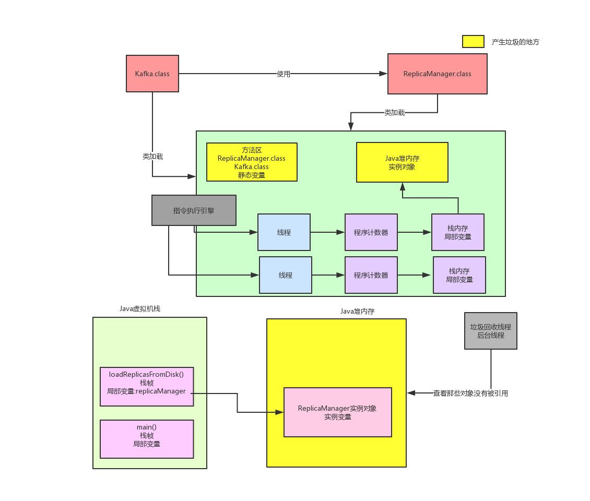

# 图示

```java
public class Kafka {
    
    public static void main(String[] args) {
        loadReplicasFromDisk();
    }
    
    public static void loadReplicasFromDisk() {
        ReplicaManager replicaManager = new ReplicaManager();
        replicaManager.load();
    }
}

public class ReplicaManager {
    
    public void load () {
        
    }
}
```

