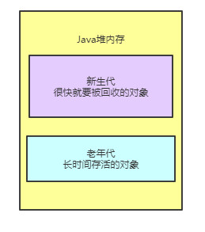

# 背景

现在我们都知道了，在代码中创建的对象都会进入到Java的堆内存中，比如下面的代码：

```java
public class Kafka {
  
    public static void main(String[] args) {
        while (true) {
            loadReplicasFromDisk();
            Thread.sleep(1000)
        }
    }
    
    public static void loadReplicasFromDisk() {
        ReplicaManager replicaManager = new ReplicaManager();
        replicaManager.load();
    }
}
```

这段代码会周期性的在main()方法中执行loadReplicasFromDisk()方法，加载数据。

一旦执行main()方法就会把main()方法的栈帧压如到main线程的Java虚拟机栈

如图所示：

.jpg)

然后每次在while循环里，调用loadReplicasFromDisk()方法，就会把loadReplicasFromDisk()方法的栈帧压入自己的Java虚拟机栈

.jpg)

接着在执行loadReplicasFromDisk()方法的时候，会在Java堆内存里会创建一个ReplicaManager对象实例

而且loadReplicasFromDisk()方法的栈帧里会有“replicaManager”局部变量去引用Java堆内存里的ReplicaManager对象实例

.jpg)

然后就会执行ReplicaManager对象的load()方法。


# 大部分对象都是存活周期极短的

现在有一个问题，在上面代码中，那个ReplicaManager对象，实际上属于短暂存活的这么一个对象

可以观察一下，在loadReplicasFromDisk()方法中创建这个对象，然后执行ReplicaManager对象的load()方法，然后执行完毕之后，loadReplicasFromDisk()方法就会结束。

一旦方法结束，那么loadReplicasFromDisk()方法的栈帧就会出栈

如图所示：

.jpg)

此时一旦没人引用这个ReplicaManager对象了，就会被JVM的垃圾回收线程给回收掉，释放内存空间，

注：垃圾回收的时候才会回收掉不是马上回收掉

如下图：

.jpg)

然后在main()方法的while循环里，下一次循环再次执行loadReplicasFromDisk()方法的时候，又会走一遍上面那个过程，把loadReplicasFromDisk()方法的栈帧压入Java虚拟机栈，然后构造一个ReplicaManager实例对象放在Java堆里。

一旦执行完ReplicaManager对象的load()方法之后，loadReplicasFromDisk()方法又会结束，再次出栈，然后垃圾回收释放掉Java堆内存里的ReplicaManager对象。

所以其实这个ReplicaManager对象，在上面的代码中，是一个存活周期极为短暂的对象

可能每次执行loadReplicasFromDisk()方法的时候，被创建出来，然后执行他的load()方法，接着可能1毫秒之后，就被垃圾回收掉了。

所以从这段代码就可以明显看出来，大部分在我们代码里创建的对象，其实都是存活周期很短的。这种对象，其实在我们写的Java代码中，占到绝大部分的比例。


# 少数对象是长期存活的

但是我们来看另外一段代码，假如说咱们用下面的这种方式来实现同样的功能：

```java
public class Kafka {
    
    private static ReplicaManager replicaManager = new ReplicaManager();
  
    public static void main(String[] args) {
        while (true) {
            loadReplicasFromDisk();
            Thread.sleep(1000)
        }
    }
    
    public static void loadReplicasFromDisk() {
        replicaManager.load();
    }
}
```

上面那段代码的意思，就是给Kafka这个类定义一个静态变量，也就是“replicaManager”，**这个Kafka类是在JVM的方法区里的**

然后让“replicaManager”引用了一个在Java堆内存里创建的ReplicaManager实例对象，如下图。

.jpg)

接着在main()方法中，就会在一个while循环里，不停的调用ReplicaManager对象的load()方法，做成一个周期性运行的模式。

这个时候，我们就要来思考一下，这个ReplicaManager实例对象，他是会一直被Kafka的静态变量引用的，然后会一直驻留在Java堆内存里，是不会被垃圾回收掉的。

因为这个实例对象他需要长期被使用，周期新的被调用load()方法，所以他就成为了一个长时间存在的对象。

那么类似这种被类的静态变量长期引用的对象，他需要长期停留在Java堆内存里，这这种对象就是生存周期很长的对象，他是轻易不会被垃圾回收的，他需要长期存在，不停的去使用他。


# JVM分代模型：年轻代和老年代

JVM将堆内存分为两个区域，一个是年轻代、一个是老年代

其中年轻代，顾名思义，就是把第一种代码示例中的那种，创建和使用完之后立马就要回收的对象放在里面

然后老年代呢，就是把第二种代码示例中的那种，创建之后需要一直长期存在的对象放在里面，

看下图：




# 为什么要分为年轻代和老年代？

为什么要区分呢？

因为这跟垃圾回收有关，对于年轻代里的对象，他们的特点是创建之后很快就会被回收，所以需要用一种垃圾回收算法

对于老年代里的对象，他们的特点是需要长期存在，所以需要另外一种垃圾回收算法，所以需要分成两个区域来放不同的对象。

**核心就是：因为存放不同生命周期的对象，所以需要不同的垃圾回收算法**


# 什么是永久代？

很简单，JVM里的永久代其实就是我们之前说的方法区

上面那个图里的方法区，其实就是所谓的永久代，你可以认为永久代就是放一些类信息的。


# 方法区会不会垃圾回收呢？

在以下几种情况下，方法区里的类会被回收。

- 首先该类的所有实例对象都已经从Java堆内存里被回收
- 其次加载这个类的ClassLoader已经被回收
- 最后，对该类的Class对象没有任何引用

满足上面三个条件就可以回收该类了。

